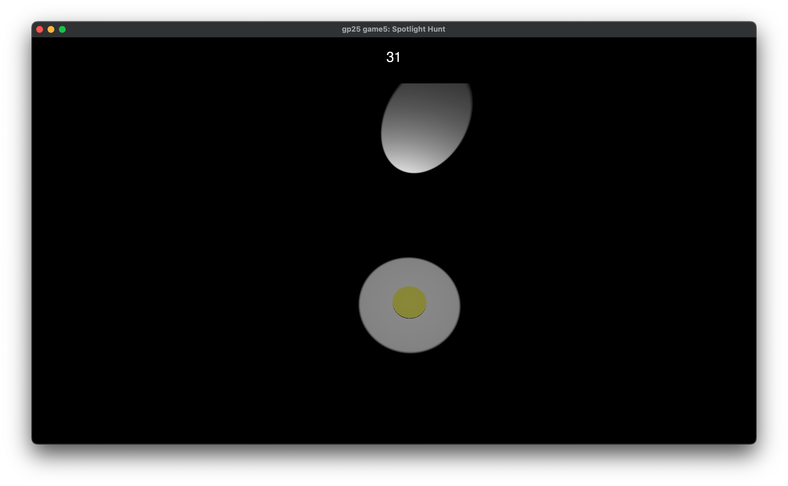
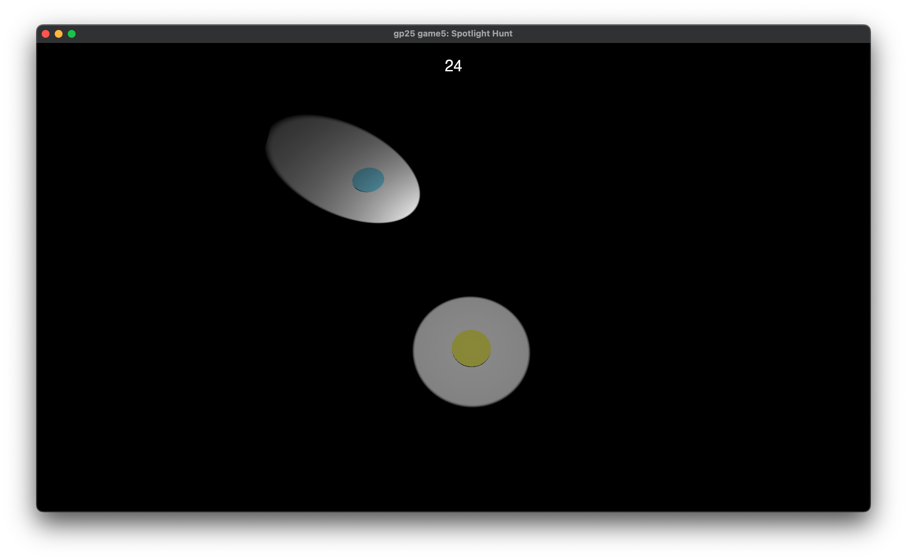
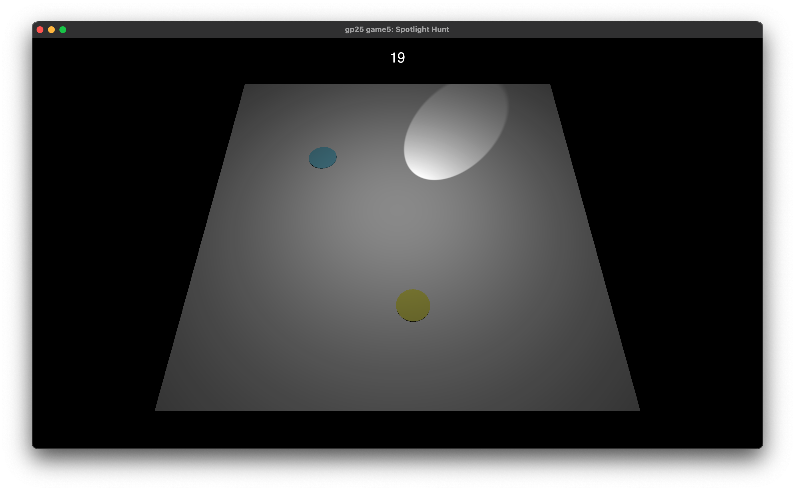

# Spotlight Hunt

**Author:** Dennis Sun

**Design:** A tense asymmetric multiplayer hide-and-seek game where the seeker’s vision is limited by both a small personal view range and a movable spotlight, while hiders can see the entire scene. Dynamic lighting and limited visibility create suspenseful gameplay focused on movement and timing.

**Networking:** 

The game uses a server-authoritative client/server model. The server runs a single `Game` instance that updates player positions, handles collisions, and manages game states (ready checks, timer, spotlight, win/lose). Clients only send input and render what the server sends back.

Messages:

- `C2S_Controls`: client → server, sends pressed key states (left/right/up/down/space).
- `S2C_State`: server → client, broadcasts the full game state — all players’ positions, velocities, roles, readiness, spotlight parameters, timer, and game state.

Code:

Message handling and serialization are in `Game::send_controls_message()`, `Game::recv_controls_message()`,  `Game::send_state_message()`,  `Game::recv_state_message()` .

**Screen Shot:**

The seeker's view:

The hider's view:

**How To Play:**

The first player to join the game becomes the seeker (the yellow circle). All subsequent players are hiders (the blue circles).

Both the seeker and hiders move using the WASD keys.

Before the game starts, players are free to move around the arena and can press Space to indicate they are ready. Once all players are ready, the game begins.

The seeker’s vision is restricted by a small personal view range and a movable spotlight, while hiders can see the entire arena. The seeker’s goal is to catch all hiders before the one-minute timer runs out, whereas hiders must avoid being caught until time expires.

If the seeker catches all hiders before the timer ends, the seeker wins. Otherwise, the hiders win.

**Sources:** 

The gameplay is inspired by my team’s game from Round 3 of the Building Virtual Worlds course.

The scene rendering system is based on the code from Game 2: https://github.com/ShaoqiangSun/15-466-f25-base2

The text rendering system is based on the code from my Choice-Based Game:
https://github.com/ShaoqiangSun/15-466-f25-base4

Font: Helvetica (system font on macOS, licensed by Apple).

 https://github.com/harfbuzz/harfbuzz-tutorial/blob/master/hello-harfbuzz-freetype.c

 https://www.freetype.org/freetype2/docs/tutorial/step1.html

 https://freetype.org/freetype2/docs/reference/index.html

 https://docs.gl/

This game was built with [NEST](NEST.md).

